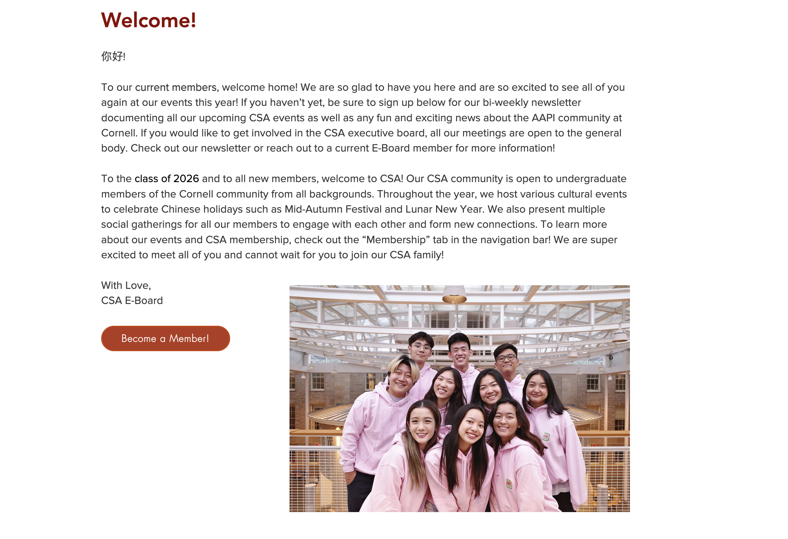
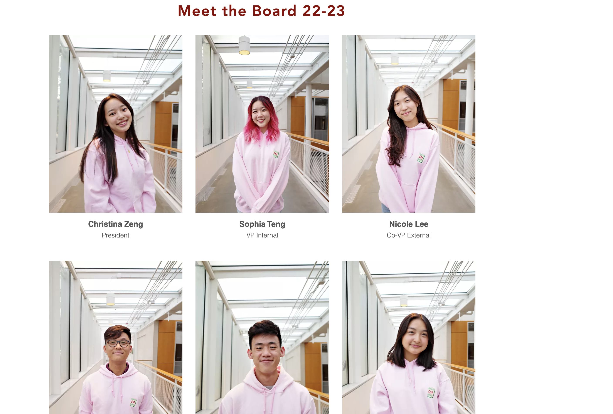
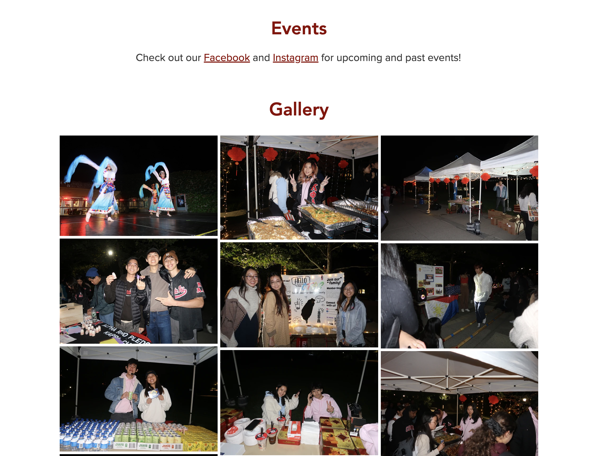
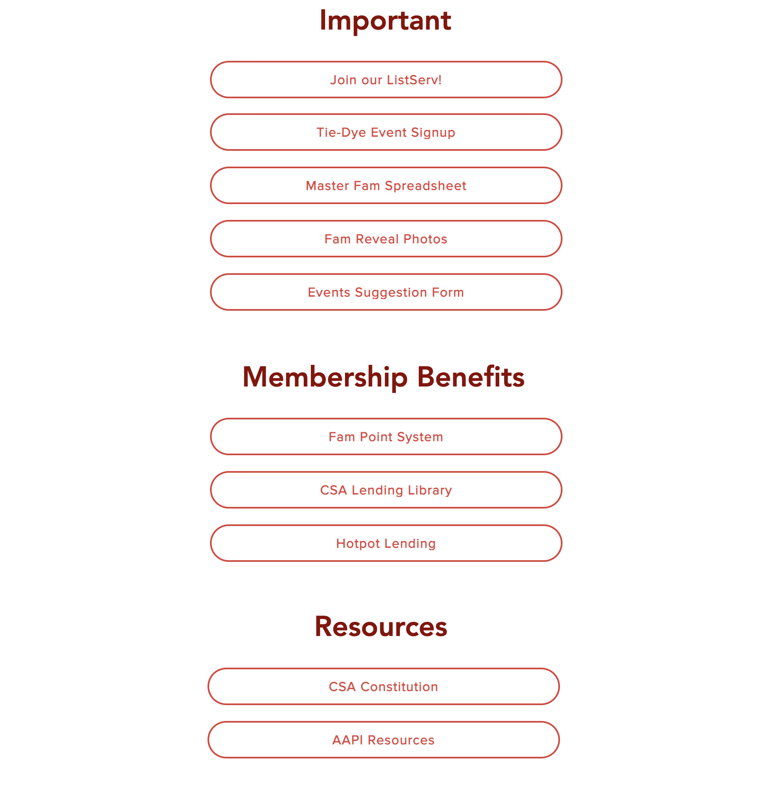
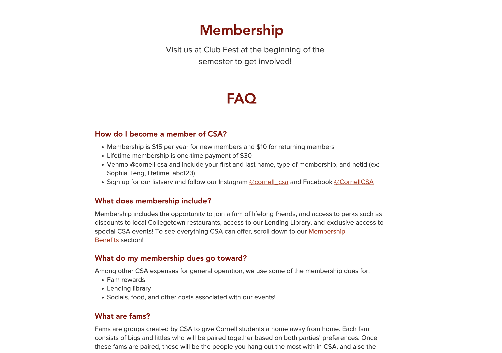
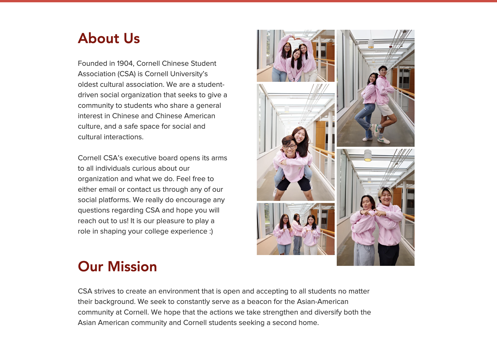

# Group Project: Design Journey

**For each milestone, complete only the sections that are labeled with that milestone.** Refine all sections before the final submission.

You are graded on your design process. If you later need to update your plan, **do not delete the original plan, leave it in place and append your new plan _below_ the original.** Then explain why you are changing your plan. Any time you update your plan, you're documenting your design process!

**Replace ALL _TODOs_ with your work.** (There should be no TODOs in the final submission.)

Be clear and concise in your writing. Bullets points are encouraged.

**Everything, including images, must be visible in _Markdown: Open Preview_.** If it's not visible in the Markdown preview, then we can't grade it. We also can't give you partial credit either. **Please make sure your design journey should is easy to read for the grader;** in Markdown preview the question _and_ answer should have a blank line between them.

## Client (Milestone 1)

### Client Description (Milestone 1)
> Tell us about your client. Who is your client?
> Explain why your client meets the client rules in the project requirements.

Our client the Chinese Student Associate (CSA). Specifically, we'll be working with Arthur and Tiffany, members of the e-board. Our client is a student organization requiring a static website redesign.

### Client Questionnaire (Milestone 1)
> Develop a client questionnaire to learn more about your client and their goals.
> You may use the questionnaire below, you may modify the questionnaire below, or you may create your own.

1. Describe your organization and its purpose.

 CSA is a student-run social and cultural organization that seeks to provide a community to students interested in Chinese and Chinese American culture. They have a social week where interested students can meet current members and join their fam (family), and they also host multiple cultural and social events throughout the year (Mid autumn festival, Midnight Dimsum, etc)

2. What makes your organization and its services special or unique?

The organization is unique because they offer a community to anyone who is interested in both Chinese and Chinese American culture, and the club isn’t limited to just Chinese members. They are also the organization that hosts the largest annual Mid-autumn festival event at Cornell on Ho Plaza, and their events like Midnight Dim Sum are also unique.

3. Why are you looking for a new website or updating your existing site?

 The website could look a bit more visually pleasing.

4. Who do you want to visit your site? Who do you believe is your website's intended audience?

They want people who are interested in the club and its events to check out the website. This year, they've decided to put important links to the club’s events (sign ups, etc) on their website, so intended audience is members but also anyone else interested in CSA events or joining CSA.

1. When visiting your site, what actions do you want your visitors to take?

 Visitors typically visit the website to join the newsletter or find links to important sign-up forms and other resources (E-board applications, etc). They also want visitors to check out the gallery so they can see what events are like

2. What are your goals for this site?

For visitors to learn more about CSA as an organization and want to join the club

4. Is there a "feel" that you want for your site? Are there colors or imagery that you have in mind?

Would like to stick with a red theme (not bright red, the current red is fine). Faving faces on the website is important as well.

3. What are your three favorite competitors or similar organizations' websites? Why?

Don't have any favorites, but can check out usc’s casa website and Harvard’s c

### First Client Meeting Minutes/Notes (Milestone 1)
> Include your notes/minutes from your first meeting with your client.

Time: ~10 minutes
Notes: CSA is a widely known cultural organization on Cornell's campus (and other schools). The org is not limited to just Chinese students; anyone can join as long as they are able to meet the social week requirements and fill out the form. The client currently wants to make the website more visually appealing while keeping the current color theme and hopes to allow the audience who visit their site (students interested in joining the club and current students already in the club) to help them find information regarding club events and how to sign up. In addition, the website provides the link to the newsletter along with sign-ups for the events; this is important information that the audience typically looks for. The client is looking to revamp their website to udpate its aesthetics while keeping the content that already exists on the site.

### Client Website (Milestone 1)
> Tell us about the website that your client wants.
> Tell us the purpose of the website and what it is all about.
> Note: **If you are redesigning an existing website, give us the current URL and some screenshots of the current site.** (FireFox makes it easy to take a full screenshot of a page from the context menu (right click).)
> If you are redesigning an existing site, tell us how you plan to update the site in a significant way that meets the project's requirements.

Current CSA Website and Screenshots:
<https://www.csacornell.org/>

The website we intend to build will keep the current color theme but will include more interactivity. We will also make the layout consistent for all the pages. For example, the membership page has a side menu bar while the other pages do not. One of the main goals of the users who visit this website is to learn about the events that CSA hosts. We will create an "Events" page that includes photos and information about the events so that is easier for the users to find this information. The client wanted a more aesthetically pleasing website and highlighted the importance of photos so we will disperse photos throughout the website more than there currently are.

### Client Goals (Milestone 1)
> Identify your client's goals for the website.
> What kind of website do they want? What are their goals for the site?
> There is no required number of goals. You need as many goals as necessary to reflect your client's desires.

- A more visually appealing website ( pictures of members throughout)
- Information about the organization should be easily accessible for users
- Convey a fun communal image of the organization which encourages users to join
- Colors scheme should be consistent with the idea of China (red)
- Highlight the communal aspect which is central to the organization

### Client Website Scope (Milestone 1)
> We want your project to be successful! It needs to be ambitious, but not too large.
> A good rule-of-thumb is that you should have about 1 content-full page for each team member.
> Explain why the website you will create for your client isn't too small and isn't too big.
> Explain why you think it's the right size for this project.

We intend to build a redesign of the current CSA website. Each member will be responsible for creating one page, as well as an extra duty that spans the entire website, such as format consistency. We hope this a is a manageable workload for all members that will result in a quality website.

## Plan/Schedule (Milestone 1)
> Make a plan of when you will complete all parts of this assignment.
> This plan is for your team. There is no required format. Format it so that it works for you!
> Your plan should include when you will interview users and analyze their goals.
> Your plan should also include how and when you will assemble/create the sit's content.
> **Tip:** Your team should plan to work ahead. This project really isn't feasible to complete the night before a deadline.

Next up, we plan to find members of CSA and non-members to interview for user interviews. By the weekend, we hope to have interviews written so we may know whom to aim for. Those who are not involved with the interviewing will begin site construction: filling out content and creating an initial theme with little styling.

## Understanding Users (Milestone 2)

**Make the case for your decisions using concepts from class, as well as other design principles, theories, examples, and cases from outside of class.**

You can use bullet points and lists, or full paragraphs, or a combo, whichever is appropriate. The writing should be solid draft quality, but it doesn't have to be fancy.

### User Interview Questions (Milestone 2)
> Plan the user interview which you'll use to identify the goals of your site's audience.
> You may use the interview template below and revise it as much as you desire.

**User Interview Briefing & Consent:** "Hi, I am a student at Cornell University. I'm currently taking a class on web design and for a project, I am designing the website for Cornell's Chinese Student Association. I'm trying to learn more about the people that might use this site. May I ask you a few questions? It will take about 10 minutes. You are free to quit at any time."

1. Please tell me a bit about yourself. You may omit any personal or private information.

2. What cultural clubs have you heard about on campus at Cornell? How did you hear about these clubs?

3. When you're looking for information about these clubs where would you look?

4. What kind of information regarding the club would you be interested in finding?

...

n. What haven't I asked you today that you think would be valuable for me to know?

**After the interview:** "This was really helpful. Thank you so much for agreeing to speak with me today. Have a great day!"

### Interview Notes (Milestone 2)
> Interview at least 1 person for every member of your team from your audience.
> Take notes and include those notes here. Make sure to include a brief description of each interviewee.
> **Copy the interview questions above into each interviewee section below.**
> Take notes for each participant inline with the questions.

**Interviewee 1: Keri Yamaguchi**

1. Please tell me a bit about yourself. You may omit any personal or private information.

Keri Y. is a Japanese-Chinese American and she has lived in Upstate NY her whole life. She went to a predominately white school district and she was exposed to very little diversity during this time.

2. What cultural clubs have you heard about on campus at Cornell? How did you hear about these clubs?

"Csa, JUSA, kasa, ksa. I hear them from social media platforms, specifically Instagram. Also, a lot of times it spreads by word of mouth as my friens also talked about them near the beginning of the school year."

3. When you're looking for information about these clubs where would you look?

"I would also go on Instagram for information regarding these organizations because I assume that these orgs have an Instagram page that stays up to date either with their LinkTree or posts regarding information and upcoming events."

4. What kind of information regarding the club would you be interested in finding?

"Information such as general meetings and events. "

5. What haven't I asked you today that you think would be valuable for me to know?

N/A

**Interviewee 2: Luke Trautwein**
1. Please tell me a bit about yourself. You may omit any personal or private information.

"My name is Luke Trautwein and I'm a current sophomore studying economics in the college of arts and sciences. I am currently not very involved on campus, but I do enjoy spending my time rock climbing and learning new skills."

2. What cultural clubs have you heard about on campus at Cornell? How did you hear about these clubs?

"I have heard of CSA, but that's about it. It's probably because most of my friends are Chinese and they talk a lot about the club and the social events that they have."

3. When you're looking for information about these clubs where would you look?

"I usually find out about clubs through Instagram or through promotional flyers that are hung up around the school. However, if I wanted to to actually find out information about a club that I heard about, I would go on Instagram."

4. What kind of information regarding the club would you be interested in finding?

"I would be interested about what the club is about, who runs the club, what activities they do, what general student commitment looks like, and how often the club meets."

n. What haven't I asked you today that you think would be valuable for me to know?

N/A

**Interviewee 3: Nathan Tai**

1. Please tell me a bit about yourself. You may omit any personal or private information.
"Hi I am student at Cornell University who enjoys weight lifting and going to class."

2. What cultural clubs have you heard about on campus at Cornell? How did you hear about these clubs?
"I have heard about the Cornell CSA club through mutual friends."

3. When you're looking for information about these clubs where would you look?
"When I look for information about these clubs I try to find out if they have a website. The website contains, as long as its updated, most of the critical information that I usually need such as events, meeting times, and who the current e-board is."

4. What kind of information regarding the club would you be interested in finding?
"I am interested in finding out how to learn more about clubs."

n. What haven't I asked you today that you think would be valuable for me to know?

N/A

**Interviewee 4: Nancy Duong**

1. Please tell me a bit about yourself. You may omit any personal or private information.

"nancy, second year info sci major at cornell"

1. What cultural clubs have you heard about on campus at Cornell? How did you hear about these clubs?

"csa, cva, kasa, hksa. thru word of mouth mostly, and instagram repost stores"

2. When you're looking for information about these clubs where would you look?

"i usually go on instagram for information"

3. What kind of information regarding the club would you be interested in finding?

"how to join, the events they host, images of their past events"

n. What haven't I asked you today that you think would be valuable for me to know?

"it doesnt seem like cva has a website if u think csa’s website is too established for a rework"

note: interesting; looks like she recommended looking at another website

**Interviewee 5: Maxwell Pang**

1. Please tell me a bit about yourself. You may omit any personal or private information.
 My name is Maxwell Pang, currently a sophomore majoring in Computer Science through the College of Engineering. Fun fact: I am scuba certified.

2. What cultural clubs have you heard about on campus at Cornell? How did you hear about these clubs?
CSA, MCSA, CSSA, HKSA, CVA, KSA, KASA, TSA, JUSA. I heard about many of these clubs through CSA because CSA (which I am apart of) does many events and collaborates with other cultural clubs.
3. When you're looking for information about these clubs where would you look?
I generally go to Instagram to find these clubs because they always have a linktree within their Instagram bio which leads to all of their stuff and generally the Instagram page is the most updated with events and such.
4. What kind of information regarding the club would you be interested in finding?
I'm looking for upcoming events and how to participate. I am also interested in finding who is actually part of the club, particuarly if there are people I know within the clubs.

### Goals (Milestone 2)
> Analyze your audience's goals from your notes above.
> List each goal below. There is no specific number of goals required for this, but you need enough to do the job (Hint: It's more than 1 and probably more than 2).

Goal 1: Learn what CSA is about, what they do?

- **Design Ideas and Choices** To emphasize/make it clear for the user what CSA stands for as a club, we will place this information in an easily accessible location for the user.
- **Rationale & Additional Notes** _Justify your decisions; additional notes._
  - Giving the about information it's own page ensures the user will be able to easily find the information since it will be clearly listed in the navigation bar. Being on it's individual page will prevent the user from having to dig through pages to find the about information since it will have its own designated location.

Goal 2: Find out what events CSA is organizing/has organized in the past

- **Design Ideas and Choices** _How will you meet those goals in your design?_
  - Similar to the design for the home page to the apple-fest project 2. Upcoming events will be explicitly displayed on the home landing page so it is the first thing visitors to the website see.
- **Rationale & Additional Notes** _Justify your decisions; additional notes._
  - By displaying the upcoming event as the first thing visitors see it will serve as an invite for users to come to the event and experience what CSA is about first hand. Since CSA is a cultural/social club events are very important in connecting members together.

Goal 3: See current members of CSA to see if any mutuals are a part of the club

**Design Ideas and Choices** _How will you meet those goals in your design?_
  - Have a gallery of member pictures for eboard and photos of people who attended CSA events and photos of fams within CSA.
- **Rationale & Additional Notes** _Justify your decisions; additional notes._
  - By having a gallery of images visitors to the website can see snippets of CSA members, not only will the gallery show users the fun atmosphere of events but they may also see a mutual friend in the club and this will encourage them to be more likely to join CSA.

### Audience (Milestone 2)
> Briefly explain your site's audience.
> Be specific and justify why this audience is a **cohesive** group with regard to your website.

TODO: site's _cohesive_ audience

## Website Design Exploration (Milestone 2)

Identify three websites (preferably static websites) that exist today on the web to draw inspiration from. Please select websites that are similar to the website you wish to create.

Include two screenshots of the home page for each site: narrow and wide.

**We'll refer to these are your "example websites."**

1. <TODO: website url>u

    Harvard CSA Utopia FAQ Narrow
    

    

    Harvard CSA Utopia FAQ Page Wide
    

2. <https://isucornell.com/>

    

    ISU Homepage Wide
    

3. <https://upenncsa.com/>

    

    

### Example Website 1 Review (Milestone 2)
> Review the website you identified above. (1 paragraph)
> In your review, include a discussion common design patterns and interactivity in the site.

TODO: website reflection/critique

### Example Website 2 Review (Milestone 2)
> Review the website you identified above. (1 paragraph)
> In your review, include a discussion common design patterns and interactivity in the site.

TODO: website reflection/critique

### Example Website 3 Review (Milestone 2)
> Review the website you identified above. (1 paragraph)
> In your review, include a discussion common design patterns and interactivity in the site.

Upenn's CSA website has three pages: "home," "events," "big little," and "board." The pages are linked at the top right corner and do not link to external pages, but rather they rubber band down to the section on the main page that discusses the section. The interactivity elements utilized are automatic scrolling gallery, carousel gallery, opening to external links, horizontal scrolling to access "events" (both upcoming and past).

## Content Planning (Milestone 2)

Plan your site's content.

### Your Site's Planned Content (Milestone 2)
> List **all** the content you plan to include your website.
> You should list all types of content you planned to include (i.e. text, photos, images, etc.)

- About information text
- Event information text
- Photos of Eboard
- Photos of events/people at events
- Images of CSA logoo
- FAQ test
- Membership information text

### Content Justification (Milestone 2)
> Explain (about a paragraph) why this content is the right content for your site's audience and how the content addresses their goals.

This content is the right content for the site's audience because the text will relay information that they need (that was found through conducting user interviews) such as what the club is about, how to be a member, what events are hosted, and an FAQ section will be included to answer any general questions that come up from people. Then, the images and pictures will provide the visual aspects to give students an idea on what the events look like. In doing this, viewers can have an idea of what the mood and structure of CSA is like. Also, there will be a section to display e-board members, which gives a face to the organization for the people viewing the website.

## Information Architecture (Milestone 2)

### Content Organization (Milestone 2)
> Document your **iterations** of card sorting here. You must have at least 2 iterations of card sorting.
> Include photographic evidence of each iteration of card sorting **and** description of your thought process for each iteration.
> Please physically sort cards; please don't try and do this digitally.

TODO: photos and explanations of each iteration

### Final Content Organization (Milestone 2)
> Which iteration of card sorting will you use for your website?

TODO: tell us which iteration of card sorting you plan to use.

> Explain how the final organization of content is appropriate for your site's audiences.

TODO: why does this organization make sense for your audience (not you)?

### Navigation (Milestone 2)
> Please list the pages you will include in your website's navigation.

- TODO: page 1
- TODO: page 2
- TODO: page 3
- ...

> Explain why the names of these pages make sense for your site's audience.

TODO: explain why the pages name make sense to the audience.

## Visual Theme (Milestone 2)
> Discuss several (more than two) ideas about styling your site's theme. Explain why the theme ideas are appropriate for your target audiences. Note the theme you selected for your site and why it's appropriate for the audience and their goals.

TODO: theme ideas, rationale, and final theme

## Design (Milestone 2)

Document your site's layout.

## Interactivity Brainstorm (Milestone 2)
> Using the audience goals you identified, brainstorm possible options for interactivity to enhance the functionality of the site while also assisting the audience with their goals.
> Briefly explain idea each idea and provide a brief rationale for how the interactivity enhances the site's functionality for the audience.
> Note: You may find it easier to sketch for brainstorming. That's fine too. Do whatever you need to do to explore your ideas.

- TODO: interactivity idea 1
- TODO: interactivity idea 2
- TODO: ...

### Layout Exploration (Milestone 2)
> Iterate on your site's design through sketching.
> Sketch both the narrow and wide versions of the site.
> Here you are just exploring your layout ideas. You don't need to sketch every page.
> Include some of your interactivity ideas in your sketches.
> Provide an explanation for each sketch explaining the idea and the design patterns you are leveraging.

TODO: layout exploration sketches + explanation

### Final Design (Milestone 2)
> Include the final sketches for each of your pages.
> **Include your final interactivity in your sketches.** Include annotations to explain what happens when the user takes an action with your interactivity.
> The sketches must include enough detail that another 1300 student could implement them.
> However, you don't need to provide layout/CSS annotations.
> Please, provide an explanation for each sketch.

**Narrow (Mobile) Design:**

TODO: narrow sketches and explanation

**Wide (Wide) Design:**

TODO: wide sketches and explanation

### Design Rationale (Milestone 2)
> Explain why your design is appropriate for your audience.
> Specifically, why does your content organization, navigation, and site design/layout meet the goals of your users?
> How did you employ **design patterns** to improve the familiarity of the site for your audience?

TODO: 1 paragraph

## Interactivity Rationale (Milestone 2)
> Describe the purpose of your proposed interactivity.
> Provide a brief rationale explaining how your proposed interactivity addresses the goals of your site's audience and enhances their user experience.

TODO: 1 paragraph

## Interactivity Plan (Milestone 2)
> Now that you've designed your interactivity for your site, you need to plan how you will implement it.
> Describe how you will implement the interactivity. This should be a complete plan that another 1300 student could use to implement the interactivity.
> You should list the HTML elements, CSS classes, events, pseudocode, and the initial state.

TODO: interactivity plan

## Client Feedback & Minutes (Milestone 2)
> You should meet with your client again to obtain feedback on your design.
> Provide a summary of the client's feedback and your meeting's minutes.

TODO: client feedback

TODO: meeting minutes

## User Testing (Final Submission)

**Conduct user testing with a minimum of 1 participant for every member of your team.**

### User Testing Tasks (Final Submission)
> Plan out your user testing tasks before doing your user testing.
> These must be actual user testing tasks.
> **Tasks are not questions!**

1. TODO: task 1

2. TODO: task 2

3. TODO: task 3

TODO: add more tasks if necessary (a good rule of thumb is a task for every user goal)

### Participant 1 (Final Submission)
> Using your notes from above, describe your user by answering the questions below.

1. Who is your user, e.g., where does the user come from, what is the user's job, characteristics, etc.?

    TODO: tell us about the participant

2. Does the user belong to your audience of the site?

    > If “No”, what’s your strategy of associating the user test results to your audience’s needs and wants? How can your re-design choices based on the user tests make a better fit for the audience?

    TODO: (Yes / No)

### Participant 1 -- Testing Notes (Final Submission)
> When conducting user testing, you should take notes during the test.

TODO: participant user test notes

### Participant 2 (Final Submission)
> Using your notes from above, describe your user by answering the questions below.

1. Who is your user, e.g., where does the user come from, what is the user's job, characteristics, etc.?

    TODO: tell us about the participant

2. Does the user belong to your audience of the site?

    > If “No”, what’s your strategy of associating the user test results to your audience’s needs and wants? How can your re-design choices based on the user tests make a better fit for the audience?

    TODO: (Yes / No)

### Participant 2 -- Testing Notes (Final Submission)
> When conducting user testing, you should take notes during the test.

TODO: participant user test notes

### Participant 3 (Final Submission)
> Using your notes from above, describe your user by answering the questions below.

1. Who is your user, e.g., where does the user come from, what is the user's job, characteristics, etc.?

    TODO: tell us about the participant

2. Does the user belong to your audience of the site?

    > If “No”, what’s your strategy of associating the user test results to your audience’s needs and wants? How can your re-design choices based on the user tests make a better fit for the audience?

    TODO: (Yes / No)

### Participant 3 -- Testing Notes (Final Submission)
> When conducting user testing, you should take notes during the test.

TODO: participant user test notes

TODO: add more participants if necessary

## Website Revision Based on User Testing (Final Submission)
> What changes did you make to your design based on user testing?

TODO: explain the revisions to your website from user testing

## Grading (Final Submission)

### Collaborators (Final Submission)
> List any persons you collaborated with on this project.

TODO: list your collaborators

### Reference Resources (Final Submission)
> Please cite any external resources you referenced in the creation of your project.
> (i.e. W3Schools, StackOverflow, Mozilla, etc.)

TODO: list reference resources
